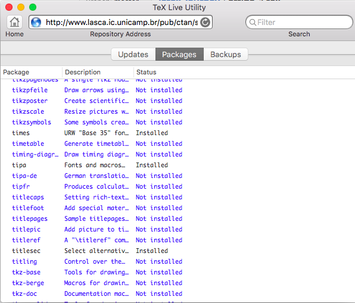
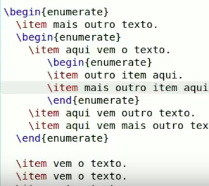
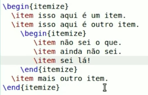
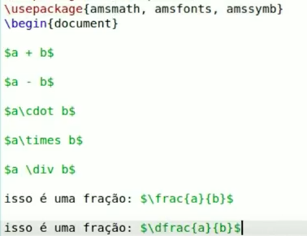
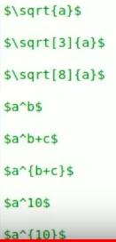
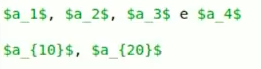
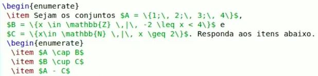

# latex-journey

> Aprendendo LaTeX

## Links

Primeiros passos no LaTeX: [http://posgraduando.com/introducao-ao-latex-os-primeiros-passos/](http://posgraduando.com/introducao-ao-latex-os-primeiros-passos/)

Video aulas sobre LaTeX: [https://www.youtube.com/watch?v=4pTf8vB9Ezg](https://www.youtube.com/watch?v=4pTf8vB9Ezg)

Editor LaTeX on line: [https://pt.sharelatex.com/](https://pt.sharelatex.com/)

## Instalando LaTeX

### macOS

```bash
brew doctor
brew update 
brew cask install texstudio
```

Faça o Download do `BasicTeX.pkg` em [https://tug.org/mactex/morepackages.html](https://tug.org/mactex/morepackages.html) e instale o software.

```bash
open /Applications/TeXstudio.app
```

#### Resolução de Problemas

**Problema:**

```tex
\RequirePackage{titlesec}
\titlelabel{\thetitle.\hspace{1ex}}
```
gera o erro: 

```
File `titlesec.sty' not found. \titlelabel
```

** Solução:**

Instale o [TeX Live Utility Versão 1.2.6](https://github.com/amaxwell/tlutility/releases)

Depois instale o pacote `titlesec`



**Problema:**

Font OT1/pcr/m/n/10=pcrr7t at 10.0pt not loadable: Metric (TFM) file not found. \maketitle

**Solução:**

```bash
tlmgr search --file pcrr7t.tfm --global
```

```
tlmgr: package repository http://linorg.usp.br/CTAN/systems/texlive/tlnet (verified)
courier:
  texmf-dist/fonts/tfm/adobe/courier/pcrr7t.tfm
```

```bash
sudo tlmgr install courier
```

Repita para `phvr7t.tfm`

```bash
tlmgr search --file phvr7t.tfm --global
sudo tlmgr install helvetic
```

Instale o pacote `texliveonfly`

```bash
sudo tlmgr install texliveonfly
find /usr/local/texlive -name "texliveonfly.*"
ls /usr/local/texlive/2016basic/texmf-dist/scripts/texliveonfly/texliveonfly.py
echo /usr/local/texlive/2016basic/texmf-dist/scripts/texliveonfly/texliveonfly.py \$1 > texlive-on-the-fly.sh 
chmod a+rx texlive-on-the-fly.sh 
./texlive-on-the-fly.sh artigo-1.tex
```


### Windows

>TBD


## Usando a Linguagem TeX

Veja os [videos do professor Aquino](https://youtu.be/F-yGTt9Bty4?list=PLa_2246N48_p9ndUHlO255uvKtSR8mshE) no YouTube

Abaixo um resumo.

#### Listas





#### Operadores e frações



#### Potências e Raizes



#### Indices para enumerados



#### Teoria de Conjuntos




